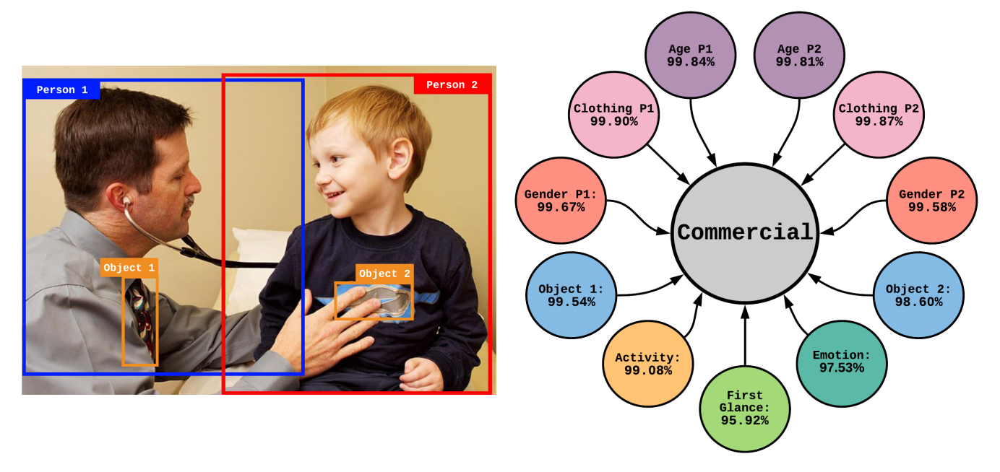
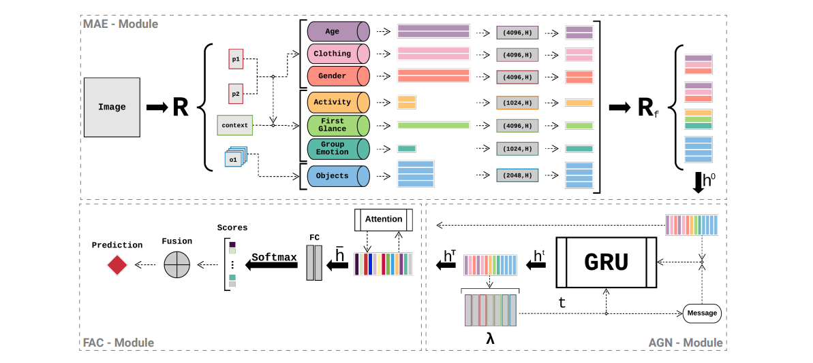

# MaGI: Multi-attribute Graph Inference for Social Relationship Recognition

[](https://svgshare.com/i/Zhy.svg)
[](https://www.python.org/)
[](https://www.pytorch.org/.org/)

> ⚠️ Implementation of the **_Attribute Graph Network (AGN)_** described by the [**_Multi-attribute Graph Inference for Social Relationship Recognition_**](paper/Multi_attribute_Graph_Inference_for_Social_Relationship_Recognition.pdf) paper.

## Overview

The image-based relation recognition task consists of identifying the social connections between each pair of individuals in a given picture. In this work, we extract **multiple attributes** for the individuals forming each pair, **identifying the most meaningful cues for each type of relationship**, as illustrated in the following image:



To achieve this, we extract the attributes using pre-trained models and represent them using a **complete graph**. These features are propagated by employing a **GRU model**, generating a final representation for the relationship, considering the contribution of multiple attributes. An overview of the framework is shown in the following figure:



## Installation

Create a new environment and activate it, then clone the repository and install the requirements using the following commands:

```Bash
git clone https://github.com/eduardoatr/Multi_attribute_Graph_Inference_SRR.git
cd Multi_attribute_Graph_Inference_SRR
pip install -r requirements.txt
```

## Datasets

Download the benchmark datasets:

- [People in Photo Album (PIPA) dataset](https://people.eecs.berkeley.edu/~nzhang/piper.html)
- [People in Social Context (PISC) dataset](https://zenodo.org/record/1059155)

Additionally, download the [relationship annotations](https://www.mpi-inf.mpg.de/departments/computer-vision-and-machine-learning/research/human-activity-recognition/social-relation-recognition) for the PIPA dataset.

## Pre-trained Models

The pre-trained models employed for attribute features extraction can be obtained from:

- [Individual Age/Gender/Clothing Features](https://www.mpi-inf.mpg.de/departments/computer-vision-and-machine-learning/research/human-activity-recognition/social-relation-recognition)
- [Relative Activity Features](http://imsitu.org/download/)
- [Relative Emotion Features](https://github.com/gxstudy/Graph-Neural-Networks-for-Image-Understanding-Based-on-Multiple-Cues)
- [General Object Features](https://github.com/hujie-frank/SENet)

## Training and Testing

Process the original data, building the **tfrecords** feature packs, fill in the necessary parameters and use the **training.sh** and **testing.sh** scripts to train a model and run it on inference mode.
